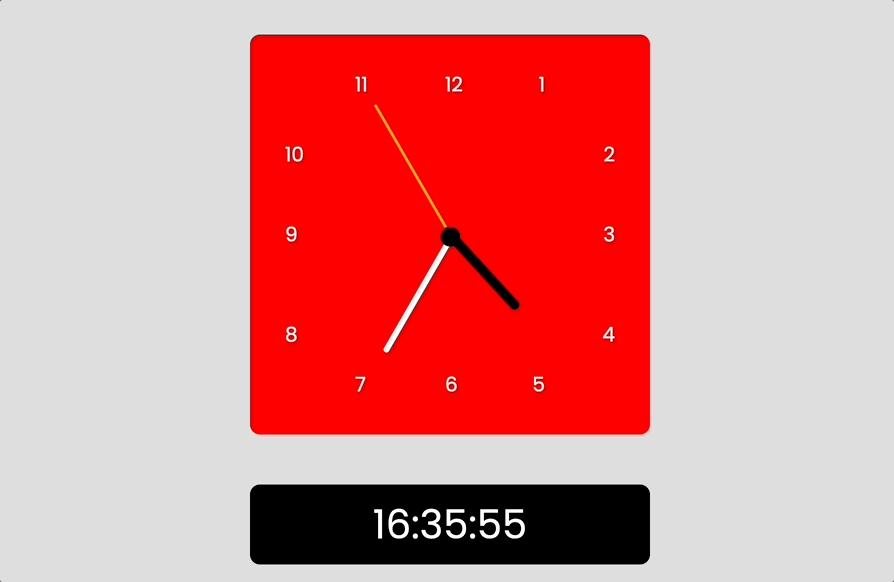

# Analog and digital clocks with HTML, CSS and JavaScript

[Click here][1] to see working version of this project.

[1]: https://making-analog-and-digital-clocks-with-html-css-and-js.vercel.app/            "Vercel"
